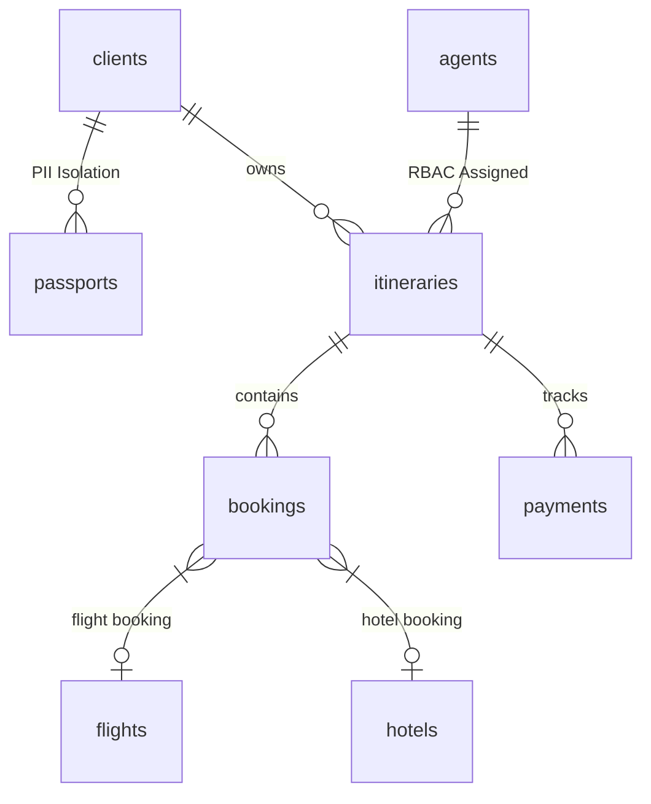
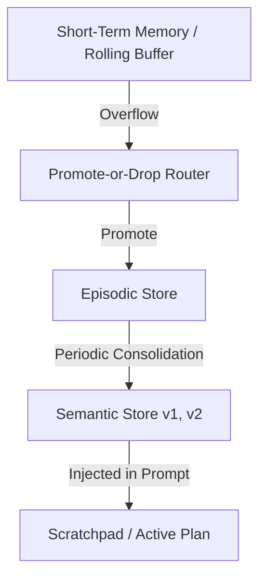

# Wanderpath Travel Agency — Autonomous Agentic MCP System ✈️

This repository contains the production implementation of the Model Context Protocol (MCP) server, long-term memory architecture, and multi-tier RAG system for **Wanderpath Travel B.**

---

## Table of Contents

1. [Executive Summary & Problem Framing](#1-executive-summary--problem-framing)
2. [Relational Database & Security Architecture](#2-relational-database--security-architecture-db)
3. [MCP Protocol Implementations](#3-mcp-protocol-implementations-mcp_server)
4. [Dual Transport Architecture](#4-dual-transport-architecture-stdio--streamable-http--sse)
5. [Long-Term Memory Architecture](#5-long-term-memory-architecture-memory)
6. [Unstructured Knowledge Base & Multi-Tier RAG](#6-unstructured-knowledge-base--multi-tier-rag-rag)
7. [Empirical Evaluation Benchmarks](#7-empirical-evaluation-benchmarks)
8. [Directory Structure](#8-directory-structure)
9. [Setup & Execution Instructions](#9-setup--execution-instructions)

---

## 1. Executive Summary & Problem Framing

Wanderpath Travel B. is an international boutique travel management agency. Customer service agents handle complex itinerary modifications, international visa compliance, and non-refundable booking cancellations.

Exposing a Large Language Model (LLM) directly to production SQL databases, or granting unmonitored write capabilities, creates severe operational liabilities: hallucinated refund authorizations, accidental cancellations of non-refundable flight segments, and accidental leakage of sensitive customer PII (passport numbers).

To solve these high-stakes challenges, we engineered a two-tier architecture:

- **Defensive MCP Server** (`mcp_server/`): Sits between the LLM agent and the relational database, enforcing strongly typed JSON schemas (`additionalProperties: false`), handler-level authorization, mid-call human sign-off triggers (Elicitation), dynamic runtime capability shifts (Notifications), and long-running progress updates (Progress Tracking).
- **Long-Term Memory & RAG Engine** (`memory/`, `rag/`): Decouples active plan tracking from transcript pruning (Scratchpad), routes evicted turns via a Promote-or-Drop Router, periodically consolidates episodic logs into versioned semantic facts with explicit conflict resolution (Consolidation Engine), and grounds agent responses across unstructured policy guides using a multi-tier RAG engine guarded by a Self-RAG Verifier.

---

## 2. Relational Database & Security Architecture (`db/`)

The relational database (`db/schema.sql`) uses a normalized relational model backed by deterministic seed data (`db/seed.sql`) and explicit integrity constraints.



### Safety & Integrity Mechanics

- **PII Isolation:** Passport records are isolated in a dedicated `passports` table. Standard itinerary queries never load passport identifiers into the prompt context unless explicitly required for international entry rule validation.
- **Polymorphic Integrity:** The `bookings` table enforces a strict database-level `CHECK` constraint —
  ```sql
  (booking_type = 'flight' AND flight_id IS NOT NULL AND hotel_id IS NULL)
  OR
  (booking_type = 'hotel' AND hotel_id IS NOT NULL AND flight_id IS NULL)
  ```
  — to guarantee a booking row is exclusively either a flight or a hotel.
- **Edge-Case Seeding:** The seed data explicitly includes non-refundable flight bookings (`is_refundable = 0`), expired passports, and role splits (`junior_agent` vs. `senior_manager`) to test all protocol boundaries.

---

## 3. MCP Protocol Implementations (`mcp_server/`)

Our server implements all 7 core Model Context Protocol concerns over both local **stdio** and network **Streamable HTTP / SSE** transports:

| # | Protocol Concern | Implementation Details | Verification Script |
|---|---|---|---|
| 1 | **Capabilities Negotiation** | Server explicitly declares tools, resources, and prompts support during the `initialize` exchange; the client validates these declarations before invoking operations. | `agent/test_handshake.py` |
| 2 | **Resources** (`policy://passport-rules`) | Exposes static international passport and visa policy documents read from `passport_policy.md` via `resources/read`. | `agent/test_resources_prompts.py` |
| 3 | **Prompts** (`draft_refund_explanation`) | Exposes parameterized prompt templates accepting required arguments (`booking_id`, `client_name`, `refund_amount`). | `agent/test_resources_prompts.py` |
| 4 | **Dynamic Notifications** | Elevating session role (`authenticate_manager`) fires a server-side `notifications/tools/list_changed` push event, dynamically unlocking privileged tools (`override_cancellation_fee`) without reconnecting. | `agent/test_notifications.py` |
| 5 | **Elicitation** (Human-in-the-Loop) | Invoking `cancel_booking` on a non-refundable flight pauses execution mid-call, issuing an elicitation request that demands explicit human `APPROVED` sign-off before mutating database state. | `agent/test_elicitation.py` |
| 6 | **Progress Tracking** | `generate_itinerary_report` streams multi-stage progress notifications (`progress` / `total`) across the transport layer during multi-step processing. | `agent/test_progress.py` |
| 7 | **Defensive Tool Specifications** | `modify_booking_dates` enforces strict JSON schema typing (`additionalProperties: false`), handler-level RBAC (`PERMISSION_DENIED` for junior agents), and business logic validation (end date > start date). | `agent/test_defensive_design.py` |

---

## 4. Dual Transport Architecture (stdio & Streamable HTTP / SSE)

The server natively supports two transport layers, configured via CLI flags:

- **Standard Input/Output (stdio):** Used for local process execution and agent loop development.
  ```bash
  python mcp_server/server.py --transport stdio
  ```
- **Streamable HTTP / SSE (sse):** Powered by an ASGI architecture with Starlette and Uvicorn. Exposes `/sse` for EventSource connections and `/messages` for JSON-RPC POST payloads.
  ```bash
  python mcp_server/server.py --transport sse --port 8000
  ```

---

## 5. Long-Term Memory Architecture (`memory/`)

To prevent session context bloat while preserving working goals and long-term customer context, the memory system is split into distinct layers:



- **Decoupled Scratchpad** (`memory/scratchpad.py`): Stores the active goal, sub-goals, completed steps, and working notes. Pruning or truncating the conversational transcript has zero side effects on the Scratchpad.
- **Promote-or-Drop Router** (`memory/routing.py`): Evaluates messages evicted from short-term memory. High-value operational events are promoted to `EpisodicStore` with explicit reasoning logged, while transient small talk is dropped (`FORGET`). The router never writes directly to semantic memory.
- **Semantic Consolidation Engine** (`memory/consolidation.py`): A separate, periodic batch pass sweeps over `EpisodicStore`, synthesizing structured semantic facts (`SemanticStore`). It resolves real conflicts (e.g., a client updating seat preferences from Window to Aisle due to a leg injury) by versioning the fact (`v1 -> v2`), setting `superseded_at` timestamps, and marking old records as `SUPERSEDED` rather than silently overwriting them.

---

## 6. Unstructured Knowledge Base & Multi-Tier RAG (`rag/`)

Unstructured internal policy manuals (e.g., boutique hotel guides and travel advisories) are chunked and indexed into a **ChromaDB Vector Store** using an **HNSW Cosine ANN Index** with metadata payload indexing.

### Supported Retrieval Architectures (`rag/architectures/retrievers.py`)

- **Naive RAG:** Dense vector similarity matching using HNSW cosine distance.
- **Hybrid Search RAG:** Reciprocal Rank Fusion (RRF) combining dense vector similarity scores with sparse BM25 keyword scoring (`rank_bm25`).
- **Agentic RAG:** Multi-step reasoning loop that evaluates context sufficiency, executes targeted sub-queries, and aggregates context chunks.
- **Graph RAG** (Bonus Architecture): Knowledge Graph implementation (`networkx`) modeling Hotel, City, Advisory, and Policy nodes. Performs 2-hop neighborhood traversals to resolve multi-entity relational dependencies.

### Self-RAG Verification Layer (`rag/self_rag.py`)

Before returning answers to the user, an explicit reflection pass enforces two checks:

- **IS_RELEVANT:** Verifies if retrieved context chunks match query terms.
- **IS_SUPPORTED:** Verifies if key claims in the generated response are grounded in the context chunks (rejecting hallucinations).

---

## 7. Empirical Evaluation Benchmarks

### A. Context Management Strategy Benchmark (`context_eval/`)

Evaluated across long, tool-heavy test transcripts where target facts are buried under noisy JSON observations:

| Strategy | Task Accuracy | Avg Tokens / Run | Avg Latency |
|---|---|---|---|
| Sliding Window | 1/3 (33%) | 448 | 4.00 ms |
| **Tool Output Masking (Selected Default)** | **3/3 (100%)** | **109** | 9.00 ms |
| Recursive Summarization | 2/3 (66%) | 534 | 2.00 ms |
| Zone-Based Pruning | 1/3 (33%) | 448 | 5.00 ms |

**Architectural Decision Justification:** Because MCP context window bloat is heavily dominated by large JSON tool observations rather than conversational dialogue, Tool Output Masking achieves 100% target fact recall at the lowest token footprint.

### B. Retrieval Architecture Benchmark (`retrieval_eval/`)

Evaluated across 6 domain-specific test questions:

| Architecture | Accuracy | Avg Tokens / Query | Avg Latency |
|---|---|---|---|
| Naive RAG (Vector Only) | 6/6 (100%) | 331 | 62.96 ms |
| **Hybrid Search (Vector + BM25) (Selected Default)** | **6/6 (100%)** | **331** | **61.02 ms** |
| Agentic RAG (Multi-Step) | 6/6 (100%) | 732 | 59.61 ms |
| Graph RAG (Bonus Knowledge Graph) | 2/6 (33%) | 68 | 0.06 ms |

**Architectural Decision Justification:** Hybrid Search (Vector + BM25) provides the lowest single-pass retrieval latency (61.02 ms) and minimal token overhead while maintaining 100% accuracy. Graph RAG is retained as a specialized fallback path for complex multi-entity relational queries.

---

## 8. Directory Structure

```
project-3/
├── README.md                     # Consolidated project documentation & benchmarks
├── demo_transcript.txt           # Executed test transcript verifying all concerns
├── .env                           # Environment variables (MISTRAL_API_KEY)
│
├── db/                             # Database Layer
│   ├── schema.sql                 # ANSI-SQL creation script with constraints
│   ├── seed.sql                   # Normal & edge-case seed data
│   └── schema.dbml                # DBML ERD schema definition
│
├── mcp_server/                     # MCP Server Core
│   ├── server.py                  # Dual-transport MCP server implementation
│   └── resources/
│       └── passport_policy.md     # Static international passport policy document
│
├── agent/                          # Agent Core & Verification Suite
│   ├── agent.py                   # Production Agent Loop (MCP + Memory + RAG + Self-RAG)
│   ├── smoke_test_all.py          # Master Lab 1 Smoke Test (All 7 MCP Concerns)
│   ├── smoke_test_lab2.py         # Master Lab 2 Smoke Test (Memory & RAG Concerns)
│   ├── test_handshake.py          # Handshake & capability negotiation test
│   ├── test_resources_prompts.py  # Resources and prompts discovery test
│   ├── test_notifications.py      # Dynamic RBAC tool list notification test
│   ├── test_elicitation.py        # Elicitation mid-call pause test
│   ├── test_progress.py           # Long-running progress tracking test
│   ├── test_defensive_design.py   # JSON schema and handler authorization test
│   └── test_transport.py          # Streamable HTTP / SSE transport test
│
├── memory/                         # Memory Subsystem
│   ├── short_term.py              # Rolling short-term message buffer
│   ├── scratchpad.py              # Active goal and sub-goal plan scratchpad
│   ├── stores.py                  # Episodic and Semantic store definitions
│   ├── routing.py                 # Promote-or-Drop overflow router
│   └── consolidation.py           # Periodic semantic consolidation & conflict engine
│
├── context_eval/                   # Context Management Evaluation
│   ├── strategies.py              # 4 context pruning strategy implementations
│   ├── test_suite.py              # Long-context tool-heavy test transcripts
│   └── eval_context.py            # Context benchmark runner
│
├── rag/                             # Retrieval & Vector Engine
│   ├── vector_store.py            # ChromaDB HNSW vector store with metadata filtering
│   ├── self_rag.py                # Self-RAG relevance and groundedness verifier
│   ├── corpus/
│   │   └── wanderpath_guide.md    # Unstructured hotel guide and policy binder
│   └── architectures/
│       └── retrievers.py          # Naive, Hybrid, Agentic, and Graph RAG retrievers
│
└── retrieval_eval/                  # Retrieval Architecture Evaluation
    ├── test_questions.json        # 6 domain-specific test benchmark questions
    └── eval_retrieval.py           # Retrieval benchmark runner
```

---

## 9. Setup & Execution Instructions

### 1. Environment & Dependency Installation

Ensure Python 3.10+ is active, then install all project dependencies:

```powershell
uv pip install mcp fastmcp starlette uvicorn httpx python-dotenv chromadb rank-bm25 networkx
```

Configure your `.env` file in the root directory:

```env
MISTRAL_API_KEY=your_mistral_api_key_here
```
