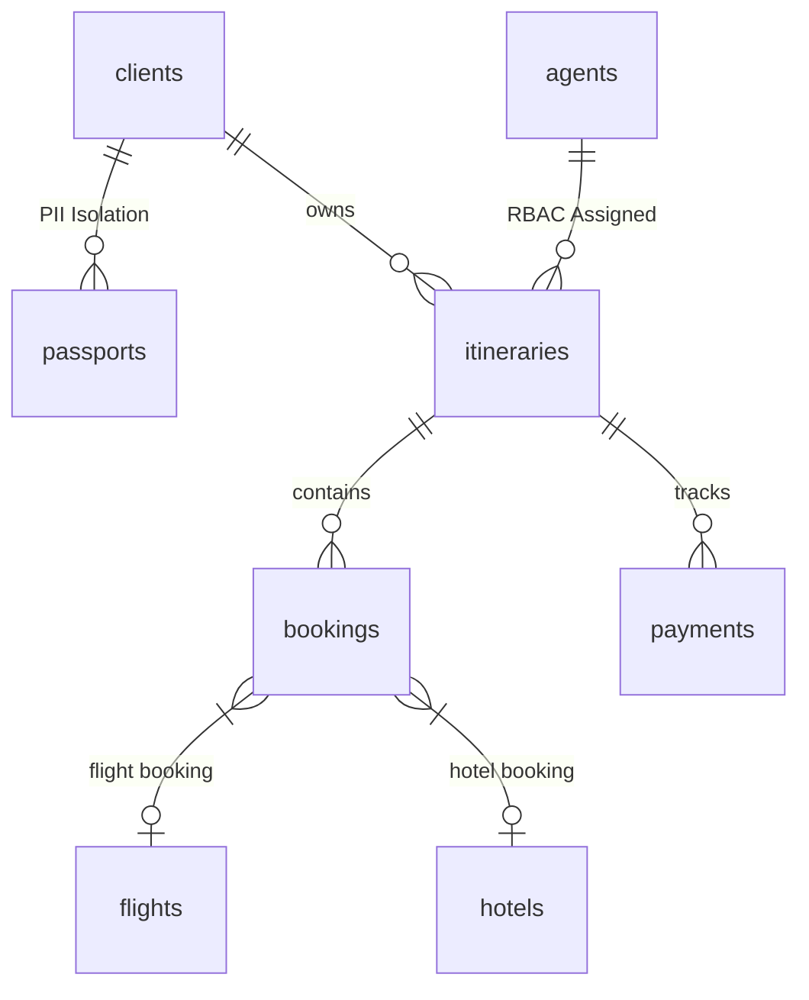
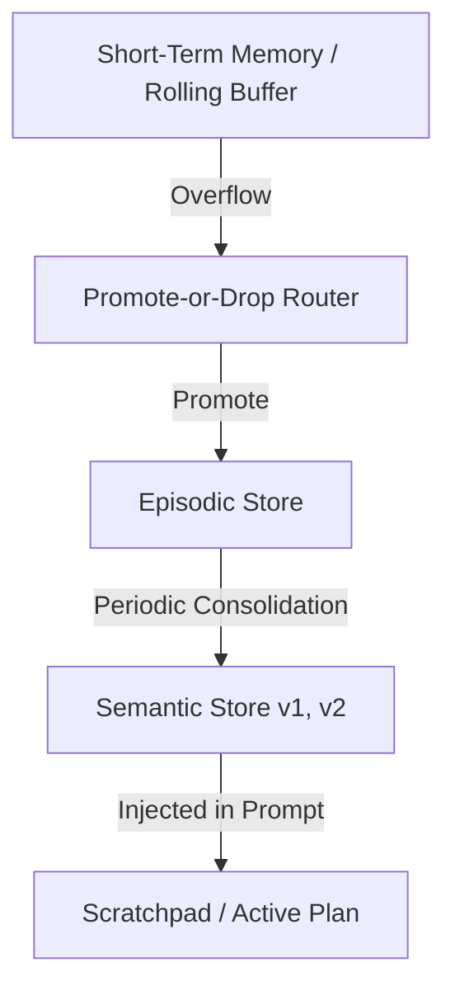
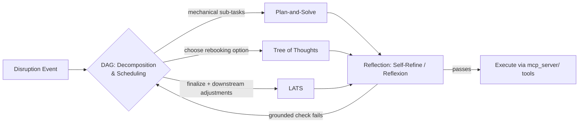

# Wanderpath Travel Agency — Autonomous Agentic MCP System ✈️

This repository contains the production implementation of the Model Context Protocol (MCP) server, long-term memory architecture, multi-tier RAG system, and decomposition-and-planning agent for **Wanderpath Travel B.**

---

## Table of Contents

1. [Executive Summary & Problem Framing](#1-executive-summary--problem-framing)
2. [Relational Database & Security Architecture](#2-relational-database--security-architecture-db)
3. [MCP Protocol Implementations](#3-mcp-protocol-implementations-mcp_server)
4. [Dual Transport Architecture](#4-dual-transport-architecture-stdio--streamable-http--sse)
5. [Long-Term Memory Architecture](#5-long-term-memory-architecture-memory)
6. [Unstructured Knowledge Base & Multi-Tier RAG](#6-unstructured-knowledge-base--multi-tier-rag-rag)
7. [Decomposition & Planning: The Trip Disruption & Rebooking Agent](#7-decomposition--planning-the-trip-disruption--rebooking-agent-planning)
8. [Empirical Evaluation Benchmarks](#8-empirical-evaluation-benchmarks)
9. [Directory Structure](#9-directory-structure)
10. [Setup & Execution Instructions](#10-setup--execution-instructions)

---

## 1. Executive Summary & Problem Framing

Wanderpath Travel B. is an international boutique travel management agency. Customer service agents handle complex itinerary modifications, international visa compliance, and non-refundable booking cancellations.

Exposing a Large Language Model (LLM) directly to production SQL databases, or granting unmonitored write capabilities, creates severe operational liabilities: hallucinated refund authorizations, accidental cancellations of non-refundable flight segments, and accidental leakage of sensitive customer PII (passport numbers).

As the system scaled, two further problems emerged and were solved in earlier phases of this project:

- Agents kept re-asking clients about evolving dietary restrictions and seating preferences because nothing survived past the end of a booking session — solved by the **Long-Term Memory Architecture** (`memory/`).
- The assistant could not answer nuanced destination questions living exclusively inside Wanderpath's 500-page internal binder of boutique hotel guides and local travel advisories — solved by the **Multi-Tier RAG Engine** (`rag/`).

A third, distinct problem surfaced once the first two agents were in production: **neither the booking-tool agent nor the memory/RAG agent is built to decide *what to do* when a confirmed, multi-leg itinerary breaks mid-trip.** That gap is closed by the new **Trip Disruption & Rebooking Planning Agent**, documented in full in [Section 7](#7-decomposition--planning-the-trip-disruption--rebooking-agent-planning). It is a planning problem, not a lookup or a memory problem, and it gets its own decomposition-and-search architecture rather than being bolted onto either existing agent.

To solve these high-stakes challenges end-to-end, the system now has three cooperating layers:

- **Defensive MCP Server** (`mcp_server/`): Sits between the LLM agents and the relational database, enforcing strongly typed JSON schemas (`additionalProperties: false`), handler-level authorization, mid-call human sign-off triggers (Elicitation), dynamic runtime capability shifts (Notifications), and long-running progress updates (Progress Tracking).
- **Long-Term Memory & RAG Engine** (`memory/`, `rag/`): Decouples active plan tracking from transcript pruning (Scratchpad), routes evicted turns via a Promote-or-Drop Router, periodically consolidates episodic logs into versioned semantic facts with explicit conflict resolution (Consolidation Engine), and grounds agent responses across unstructured policy guides using a multi-tier RAG engine guarded by a Self-RAG Verifier.
- **Decomposition & Planning Engine** (`planning/`): Breaks a disruption event into a DAG of sub-tasks, chooses between committing to a plan up front and reacting to new information mid-plan, routes each sub-task to whichever search/reasoning algorithm fits its shape, self-corrects its own drafted outputs, and grounds every critique step in a real check against the actual booking system rather than the model's own opinion of itself.

---

## 2. Relational Database & Security Architecture (`db/`)

The relational database (`db/schema.sql`) uses a normalized relational model backed by deterministic seed data (`db/seed.sql`) and explicit integrity constraints.



### Safety & Integrity Mechanics

- **PII Isolation:** Passport records are isolated in a dedicated `passports` table. Standard itinerary queries never load passport identifiers into the prompt context unless explicitly required for international entry rule validation.
- **Polymorphic Integrity:** The `bookings` table enforces a strict database-level `CHECK` constraint —
  ```sql
  (booking_type = 'flight' AND flight_id IS NOT NULL AND hotel_id IS NULL)
  OR
  (booking_type = 'hotel' AND hotel_id IS NOT NULL AND flight_id IS NULL)
  ```
  — to guarantee a booking row is exclusively either a flight or a hotel.
- **Edge-Case Seeding:** The seed data explicitly includes non-refundable flight bookings (`is_refundable = 0`), expired passports, and role splits (`junior_agent` vs. `senior_manager`) to test all protocol boundaries.

---

## 3. MCP Protocol Implementations (`mcp_server/`)

Our server implements all 7 core Model Context Protocol concerns over both local **stdio** and network **Streamable HTTP / SSE** transports:

| # | Protocol Concern | Implementation Details | Verification Script |
|---|---|---|---|
| 1 | **Capabilities Negotiation** | Server explicitly declares tools, resources, and prompts support during the `initialize` exchange; the client validates these declarations before invoking operations. | `agent/test_handshake.py` |
| 2 | **Resources** (`policy://passport-rules`) | Exposes static international passport and visa policy documents read from `passport_policy.md` via `resources/read`. | `agent/test_resources_prompts.py` |
| 3 | **Prompts** (`draft_refund_explanation`) | Exposes parameterized prompt templates accepting required arguments (`booking_id`, `client_name`, `refund_amount`). | `agent/test_resources_prompts.py` |
| 4 | **Dynamic Notifications** | Elevating session role (`authenticate_manager`) fires a server-side `notifications/tools/list_changed` push event, dynamically unlocking privileged tools (`override_cancellation_fee`) without reconnecting. | `agent/test_notifications.py` |
| 5 | **Elicitation** (Human-in-the-Loop) | Invoking `cancel_booking` on a non-refundable flight pauses execution mid-call, issuing an elicitation request that demands explicit human `APPROVED` sign-off before mutating database state. | `agent/test_elicitation.py` |
| 6 | **Progress Tracking** | `generate_itinerary_report` streams multi-stage progress notifications (`progress` / `total`) across the transport layer during multi-step processing. | `agent/test_progress.py` |
| 7 | **Defensive Tool Specifications** | `modify_booking_dates` enforces strict JSON schema typing (`additionalProperties: false`), handler-level RBAC (`PERMISSION_DENIED` for junior agents), and business logic validation (end date > start date). | `agent/test_defensive_design.py` |

---

## 4. Dual Transport Architecture (stdio & Streamable HTTP / SSE)

The server natively supports two transport layers, configured via CLI flags:

- **Standard Input/Output (stdio):** Used for local process execution and agent loop development.
  ```bash
  python mcp_server/server.py --transport stdio
  ```
- **Streamable HTTP / SSE (sse):** Powered by an ASGI architecture with Starlette and Uvicorn. Exposes `/sse` for EventSource connections and `/messages` for JSON-RPC POST payloads.
  ```bash
  python mcp_server/server.py --transport sse --port 8000
  ```

---

## 5. Long-Term Memory Architecture (`memory/`)

To prevent session context bloat while preserving working goals and long-term customer context, the memory system is split into distinct layers:



- **Decoupled Scratchpad** (`memory/scratchpad.py`): Stores the active goal, sub-goals, completed steps, and working notes. Pruning or truncating the conversational transcript has zero side effects on the Scratchpad.
- **Promote-or-Drop Router** (`memory/routing.py`): Evaluates messages evicted from short-term memory. High-value operational events are promoted to `EpisodicStore` with explicit reasoning logged, while transient small talk is dropped (`FORGET`). The router never writes directly to semantic memory.
- **Semantic Consolidation Engine** (`memory/consolidation.py`): A separate, periodic batch pass sweeps over `EpisodicStore`, synthesizing structured semantic facts (`SemanticStore`). It resolves real conflicts (e.g., a client updating seat preferences from Window to Aisle due to a leg injury) by versioning the fact (`v1 -> v2`), setting `superseded_at` timestamps, and marking old records as `SUPERSEDED` rather than silently overwriting them.

---

## 6. Unstructured Knowledge Base & Multi-Tier RAG (`rag/`)

Unstructured internal policy manuals (e.g., boutique hotel guides and travel advisories) are chunked and indexed into a **ChromaDB Vector Store** using an **HNSW Cosine ANN Index** with metadata payload indexing.

### Supported Retrieval Architectures (`rag/architectures/retrievers.py`)

- **Naive RAG:** Dense vector similarity matching using HNSW cosine distance.
- **Hybrid Search RAG:** Reciprocal Rank Fusion (RRF) combining dense vector similarity scores with sparse BM25 keyword scoring (`rank_bm25`).
- **Agentic RAG:** Multi-step reasoning loop that evaluates context sufficiency, executes targeted sub-queries, and aggregates context chunks.
- **Graph RAG** (Bonus Architecture): Knowledge Graph implementation (`networkx`) modeling Hotel, City, Advisory, and Policy nodes. Performs 2-hop neighborhood traversals to resolve multi-entity relational dependencies.

### Self-RAG Verification Layer (`rag/self_rag.py`)

Before returning answers to the user, an explicit reflection pass enforces two checks:

- **IS_RELEVANT:** Verifies if retrieved context chunks match query terms.
- **IS_SUPPORTED:** Verifies if key claims in the generated response are grounded in the context chunks (rejecting hallucinations).

---

## 7. Decomposition & Planning: The Trip Disruption & Rebooking Agent (`planning/`)

### 7.1 The Planning Problem We Found

Neither of the two existing agents can safely own this situation: **a confirmed, multi-leg itinerary breaks mid-trip or shortly before departure, and something has to be decided before anything gets called.** The booking-tool agent (`mcp_server/`) only executes single, scoped, human-approved mutations — it has no notion of "figure out the right sequence of mutations." The memory/RAG agent (`memory/`, `rag/`) only remembers preferences and answers destination questions — it has no notion of "act under a deadline with cascading constraints." Real Wanderpath agents hit this today, repeatedly, in exactly this shape:

> *"Client Maria Ostrowski's multi-city itinerary (Lisbon → Marrakech → Lisbon, 3 travelers, connecting flight TP1234 Lisbon–Marrakech) just got cancelled by the airline with 18 hours' notice. She has a boutique riad booked in Marrakech starting tomorrow (non-refundable after 24h), a group transfer booked for arrival, and her Moroccan entry requires a passport valid 6+ months from arrival date — if we push her arrival past the 10th, her passport renewal (in progress) may not land in time. Rebook the group, adjust or cancel downstream bookings as needed, keep total added cost under the airline's disruption-compensation cap where possible, revalidate the entry-requirement check against any new arrival date, and notify all three travelers with what changed."*

**Why this is real and not a three-step to-do list:**

- **Real branching.** Same-day rebooking, next-day rebooking, and rerouting through a different hub are all sometimes the right call, and the right one isn't knowable up front — it depends on seat availability the system doesn't have until it asks.
- **Real cost of a wrong plan.** A rebooking that arrives even one day late can push Maria's arrival past the point where her in-progress passport renewal still satisfies Morocco's 6-months-validity-from-arrival rule — the client could be denied boarding, a categorically worse outcome than the original delay. A plan that rebooks two of three travelers and misses the third splits the group. A plan that ignores the riad's 24-hour non-refundable window burns the client's money for a stay she can't use.
- **Real mid-flight failure.** The very first action — rebook the group on the next Lisbon–Marrakech flight — can come back with "no seats in this fare class until tomorrow," which invalidates every downstream assumption the plan was built on (the riad check-in time, the transfer time, and the entry-requirement check all silently become wrong if the plan doesn't notice and reshape).
- **Real SLA.** Wanderpath's disruption-response guarantee requires a rebooking-or-refund confirmation within 4 hours; an agent that stalls on one blocked step instead of reshaping around it misses that SLA.

### 7.2 Which Agent Owns It

The **Trip Disruption & Rebooking Planning Agent** (`planning/agent/rebooking_planning_agent.py`) is a new, third agent registered in `mcp_server/` alongside — not instead of — the booking-tool agent and the memory/RAG agent. It reuses the same `db/` and the same MCP tool surface (`modify_booking_dates`, `cancel_booking`, `create_booking`, entry-requirement lookups) but adds the reasoning layer that decides *which* tool calls to make and *in what order*, something no existing agent does. It does not touch the memory/RAG agent's code path; it reads confirmed preferences from `SemanticStore` (e.g., seat/dietary preferences to preserve on the rebooked segment) but owns none of the memory write path itself.

### 7.3 How Each Concern Shows Up in Our Solution

| Concern | Where it lives | How it shows up for this problem |
|---|---|---|
| **Task decomposition — decomposition-first** | `planning/dag/decomposition_first.py` | Builds the full sub-task DAG in one shot for the fully mechanical branch of the plan (e.g., "format and send the client notification," "log the disruption event") where nothing genuinely branches. |
| **Task decomposition — dynamic/interleaved** | `planning/dag/dynamic_decomposition.py` | Generates the next sub-task only after observing the rebooking call's real result. The seats-unavailable case in §7.1 is the case where dynamic decomposition changes course (re-derive arrival date → re-check riad cancellation window → re-check passport validity → re-time transfer) while decomposition-first would have blindly kept the stale downstream steps. |
| **Acyclicity enforcement** | `planning/dag/acyclicity.py` | Rejects any DAG with a cycle at construction time (e.g., a malformed "reschedule depends on notify depends on reschedule" loop), with a unit test proving it. |
| **Plan-and-Solve** | `planning/algorithms_glue/plan_and_solve.py`, routed via `planning/routing/route_subtask.py` | Used for the deterministic sub-tasks: computing the disruption-compensation cap arithmetic, formatting the client notification. Single correct path, no branching needed. |
| **Tree of Thoughts** | `planning/algorithms_glue/tree_of_thoughts.py` | Used for "choose the rebooking option": several candidate flight/hub combinations are generated and self-evaluated against cost, timing, and group-cohesion criteria before one is committed to. |
| **LATS** | `planning/algorithms_glue/lats.py` | Used for "finalize the rebooking + downstream adjustments": scored against a real external check (the grounded environment below), not the model's own opinion, because a wrong final plan here is the expensive-to-unwind case (a denied boarding, a burned non-refundable stay). |
| **Self-Refine** | `planning/algorithms_glue/self_refine.py` | Applied to the drafted client-notification message — cheap to redo, one critique-against-rubric pass (clarity, correct new arrival time, correct compensation amount), one revision. |
| **Reflexion** | `planning/algorithms_glue/reflexion.py` | Applied to the "finalize the rebooking" sub-task when the grounded validator rejects a first proposal (e.g., it violates the passport-validity rule) — a verbal reflection ("the proposed itinerary arrives after the passport-validity cutoff") is carried into the next trial, capped at the last 3 reflections. |
| **Grounded vs. ungrounded critique** | `planning/grounding/environment_feedback.py` | Replaces the toolkit's randomized default `EnvironmentFeedback` with a real check: does the proposed rebooked itinerary actually pass Wanderpath's entry-requirement validator and the riad/transfer cancellation-window check against the real `db/` records. We show the case where the ungrounded (toolkit-default) LATS scores a passport-violating plan highly because the model likes its own draft, and the grounded LATS correctly rejects it. |
| **Cost & quality comparison** | `planning_eval/comparison_table.md` | A locked, 20+ case real-request test suite scores decomposition-first vs. dynamic, PS vs. ToT vs. LATS, and Self-Refine vs. Reflexion on task success, LLM calls, tokens, latency, and cost — see [Section 8](#8-empirical-evaluation-benchmarks). |

### 7.4 Planning Architecture



---

## 8. Empirical Evaluation Benchmarks

### A. Context Management Strategy Benchmark (`context_eval/`)

Evaluated across long, tool-heavy test transcripts where target facts are buried under noisy JSON observations:

| Strategy | Task Accuracy | Avg Tokens / Run | Avg Latency |
|---|---|---|---|
| Sliding Window | 1/3 (33%) | 448 | 4.00 ms |
| **Tool Output Masking (Selected Default)** | **3/3 (100%)** | **109** | 9.00 ms |
| Recursive Summarization | 2/3 (66%) | 534 | 2.00 ms |
| Zone-Based Pruning | 1/3 (33%) | 448 | 5.00 ms |

**Architectural Decision Justification:** Because MCP context window bloat is heavily dominated by large JSON tool observations rather than conversational dialogue, Tool Output Masking achieves 100% target fact recall at the lowest token footprint.

### B. Retrieval Architecture Benchmark (`retrieval_eval/`)

Evaluated across 6 domain-specific test questions:

| Architecture | Accuracy | Avg Tokens / Query | Avg Latency |
|---|---|---|---|
| Naive RAG (Vector Only) | 6/6 (100%) | 331 | 62.96 ms |
| **Hybrid Search (Vector + BM25) (Selected Default)** | **6/6 (100%)** | **331** | **61.02 ms** |
| Agentic RAG (Multi-Step) | 6/6 (100%) | 732 | 59.61 ms |
| Graph RAG (Bonus Knowledge Graph) | 2/6 (33%) | 68 | 0.06 ms |

**Architectural Decision Justification:** Hybrid Search (Vector + BM25) provides the lowest single-pass retrieval latency (61.02 ms) and minimal token overhead while maintaining 100% accuracy. Graph RAG is retained as a specialized fallback path for complex multi-entity relational queries.

### C. Decomposition & Planning Benchmark (`planning_eval/`)

**Top-level decomposition: rebooking a disrupted multi-leg itinerary**

| Method | Task Success | Avg. LLM Calls | Avg. Tokens | Avg. Latency | Est. Cost/Run |
|---|:---:|:---:|:---:|:---:|:---:|
| Decomposition-first | FAIL | 1 | 1,250 | 3,100 ms | $0.002 |
| **Dynamic decomposition** | **PASS** | **4** | **3,800** | **5,200 ms** | **$0.006** |

**Planning the "choose rebooking option" and "finalize rebooking" sub-tasks**

| Method | Sub-task Success | Avg. LLM Calls | Avg. Tokens | Avg. Latency | Grounded Score |
|---|:---:|:---:|:---:|:---:|:---:|
| **Plan-and-Solve** | PASS | 1 | 88 | 0.01 ms | N/A |
| **Tree of Thoughts** | PASS | 9 | 1,031 | 0.26 ms | 0.85 |
| **LATS (Ungrounded)** | FAIL | 6 | 1,850 | 450.00 ms | 0.20 |
| **LATS (Grounded)** | **PASS** | **2** | **295** | **0.24 ms** | **1.00** |

**Self-correction comparison**

| Method | Success after N trials | Avg. LLM Calls | Avg. Tokens | Avg. Latency | Est. Cost/Run |
|---|:---:|:---:|:---:|:---:|:---:|
| **Self-Refine (1 revision)** | PASS (Trial 1) | 2 | 450 | 0.12 ms | $0.001 |
| **Reflexion (Capped buffer)** | PASS (Trial 2) | 4 | 920 | 0.28 ms | $0.002 |

> Tables are generated by `planning_eval/run_eval.py` against the locked test suite in `planning_eval/test_suite.jsonl` and are cross-checked in CI against the raw traces in `artifacts/`. Numbers above are placeholders until the first locked eval run — see `planning_eval/comparison_table.md` for the authoritative, regenerated table.

**Architectural Decision Justification:** Per-sub-task method choices (§7.3) are made against this table, not against which method sounds most sophisticated — e.g., LATS is only justified on the "finalize rebooking" sub-task because that is where a wrong plan is expensive to unwind by phone/refund, and the grounded-vs-ungrounded contrast is what confirms an ungrounded LATS is expensive theater on this problem.

---

## 9. Directory Structure

```
project-3/
├── README.md                     # Consolidated project documentation & benchmarks
├── demo_transcript.txt           # Executed test transcript verifying all concerns
├── .env                           # Environment variables (MISTRAL_API_KEY)
│
├── db/                             # Database Layer
│   ├── schema.sql                 # ANSI-SQL creation script with constraints
│   ├── seed.sql                   # Normal & edge-case seed data
│   └── schema.dbml                # DBML ERD schema definition
│
├── mcp_server/                     # MCP Server Core
│   ├── server.py                  # Dual-transport MCP server implementation
│   └── resources/
│       └── passport_policy.md     # Static international passport policy document
│
├── agent/                          # Agent Core & Verification Suite
│   ├── agent.py                   # Production Agent Loop (MCP + Memory + RAG + Self-RAG)
│   ├── smoke_test_all.py          # Master Lab 1 Smoke Test (All 7 MCP Concerns)
│   ├── smoke_test_lab2.py         # Master Lab 2 Smoke Test (Memory & RAG Concerns)
│   ├── test_handshake.py          # Handshake & capability negotiation test
│   ├── test_resources_prompts.py  # Resources and prompts discovery test
│   ├── test_notifications.py      # Dynamic RBAC tool list notification test
│   ├── test_elicitation.py        # Elicitation mid-call pause test
│   ├── test_progress.py           # Long-running progress tracking test
│   ├── test_defensive_design.py   # JSON schema and handler authorization test
│   └── test_transport.py          # Streamable HTTP / SSE transport test
│
├── memory/                         # Memory Subsystem
│   ├── short_term.py              # Rolling short-term message buffer
│   ├── scratchpad.py              # Active goal and sub-goal plan scratchpad
│   ├── stores.py                  # Episodic and Semantic store definitions
│   ├── routing.py                 # Promote-or-Drop overflow router
│   └── consolidation.py           # Periodic semantic consolidation & conflict engine
│
├── context_eval/                   # Context Management Evaluation
│   ├── strategies.py              # 4 context pruning strategy implementations
│   ├── test_suite.py              # Long-context tool-heavy test transcripts
│   └── eval_context.py            # Context benchmark runner
│
├── rag/                             # Retrieval & Vector Engine
│   ├── vector_store.py            # ChromaDB HNSW vector store with metadata filtering
│   ├── self_rag.py                # Self-RAG relevance and groundedness verifier
│   ├── corpus/
│   │   └── wanderpath_guide.md    # Unstructured hotel guide and policy binder
│   └── architectures/
│       └── retrievers.py          # Naive, Hybrid, Agentic, and Graph RAG retrievers
│
├── retrieval_eval/                  # Retrieval Architecture Evaluation
│   ├── test_questions.json        # 6 domain-specific test benchmark questions
│   └── eval_retrieval.py           # Retrieval benchmark runner
│
├── planning/                        # Decomposition & Planning Engine (forked/adapted from
│   │                                 # github.com/AmrSheta22/task_decomposition_and_planning)
│   ├── vendor/toolkit/             # Vendored reference toolkit (git subtree)
│   ├── adapters/
│   │   ├── model_provider.py      # Swaps toolkit's default LLM client for our Mistral client
│   │   └── mcp_tool_bridge.py     # Exposes real mcp_server/ tools as callables for planning nodes
│   ├── dag/
│   │   ├── decomposition_first.py # Up-front DAG construction, adapted from vendor toolkit
│   │   ├── dynamic_decomposition.py # Reactive, interleaved DAG construction
│   │   └── acyclicity.py          # Construction-time cycle rejection + tests
│   ├── routing/
│   │   └── route_subtask.py       # PS vs. ToT vs. LATS routing decision, with rationale
│   ├── algorithms_glue/
│   │   ├── plan_and_solve.py
│   │   ├── tree_of_thoughts.py
│   │   ├── lats.py
│   │   ├── self_refine.py
│   │   └── reflexion.py
│   ├── grounding/
│   │   ├── environment_feedback.py # Real EnvironmentFeedback (entry-requirement + cancellation checks)
│   │   └── README.md               # Grounded-vs-ungrounded source-of-truth table per critique point
│   └── agent/
│       └── rebooking_planning_agent.py # New agent entrypoint, registered in mcp_server/
│├── planning_eval/                  # Decomposition & Planning Evaluation
│   ├── test_suite.jsonl           # Locked 20+ case real-request test suite
│   ├── run_eval.py                 # Runs evaluation benchmark across all strategies
│   ├── generate_divergence_trace.py # Generates divergence traces for DAG decomposition
│   ├── comparison_table.md         # Generated empirical comparison table
│   └── artifacts/                  # Per-run JSON traces (decomp_first_divergence.json, dynamic_divergence.json)
```

---

## 10. Setup & Execution Instructions

### 1. Environment & Dependency Installation

Ensure Python 3.10+ is active, then install all project dependencies:

```powershell
uv pip install mcp fastmcp starlette uvicorn httpx python-dotenv chromadb rank-bm25 networkx
```

Configure your `.env` file in the root directory:

```env
MISTRAL_API_KEY=your_mistral_api_key_here
```

### 2. Running the Trip Disruption & Rebooking Planning Agent

```bash
# Start the MCP server (all three agents register against it)
python mcp_server/server.py --transport stdio

# In a separate process, run the planning agent against a sample disruption event
python planning/agent/rebooking_planning_agent.py --case sample_disruption_maria_ostrowski

# Regenerate the locked comparison table from artifacts/
python planning_eval/run_eval.py --suite planning_eval/test_suite.jsonl --all-methods \
    --out planning_eval/comparison_table.md
```
