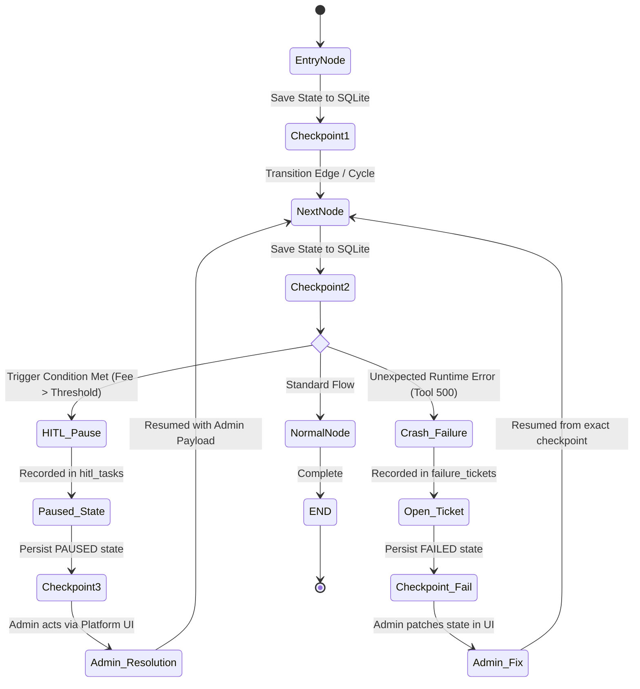

# State Graph Architecture & Durable Persistence (`state_graph/`)

## Overview
The `state_graph/` package provides the persistent execution engine for **Wanderpath Travel B.'s** long-running, multi-step, and branching agentic workflows. Unlike acyclic DAGs that execute start-to-finish in transient memory, the `StateGraph` engine supports:
1. **Cycles and Feedback Loops**: Allowing agents to revisit earlier states, refine proposals, and retry actions upon receiving new information.
2. **Durable SQLite Checkpointing**: Persisting full JSON state snapshots after *every single node transition* to durable storage.
3. **True Crash-and-Resume**: Surviving hard process termination (`SIGKILL` / `os._exit`) and resuming from the exact mid-run checkpoint without re-running completed nodes.
4. **First-Class Human-in-the-Loop (HITL) Interrupts**: Pausing execution gracefully when critical business thresholds or compliance rules require human review.
5. **Automatic Failure Ticketing**: Intercepting unexpected runtime crashes (tool failures, network drops, unparseable LLM output) and logging structured tickets in the database with state snapshots.

---

## File Manifest
* `checkpointer.py`: Implements `DurableCheckpointer` and `CheckpointRecord` for atomic SQLite state serialization and retrieval.
* `base.py`: Core `StateGraph` engine managing node execution, direct/conditional edge routing, `InterruptSignal` handling, failure ticket logging, and resumption mechanics.
* `tests/test_checkpoint_recovery.py`: Automated integration test verifying that a process abruptly killed mid-run (`os._exit(77)`) resumes from its latest SQLite checkpoint with zero state loss and zero step re-execution.

---

## State Graph Execution & Lifecycle



---

## Checkpointing Mechanics & Crash Recovery Invariant

Every node execution follows this strict sequence:
1. **Node Entry**: Updates state with `__current_node__`, `__step__`, and appends timestamped history to `__history__`.
2. **Node Invocation**: Executes the node function (sync or async).
3. **Durable Checkpoint**: Immediately executes an atomic SQLite transaction in `state_checkpoints`:
   ```sql
   INSERT INTO state_checkpoints (thread_id, checkpoint_id, parent_checkpoint_id, graph_name, current_node, state_data, step_number)
   VALUES (?, ?, ?, ?, ?, ?, ?);
   ```
4. **Transition Resolution**: Evaluates direct edges (`add_edge`) or conditional edges (`add_conditional_edge`).

### Crash-Recovery Guarantee
If the Python process is abruptly terminated at step $N$, restarting execution with the same `thread_id` executes:
```python
latest_chk = checkpointer.load_latest_checkpoint(thread_id)
# Resumes at step N+1 using latest_chk.state_data without re-running steps 1..N
```

---

## Verification
Run the automated crash-recovery verification suite:
```bash
mcp_server\.venv\Scripts\python.exe state_graph\tests\test_checkpoint_recovery.py
```
