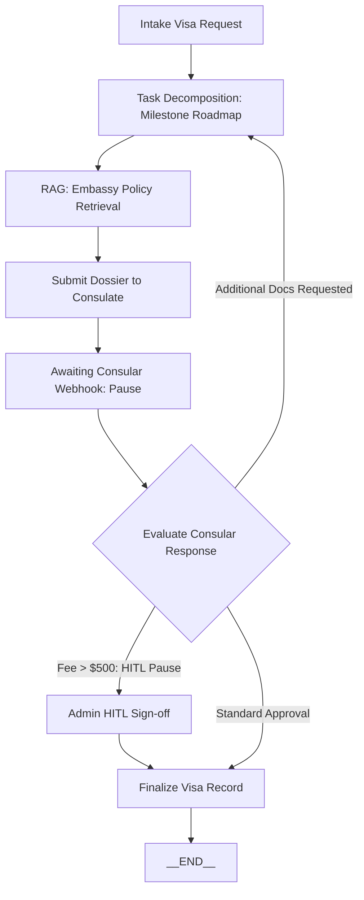
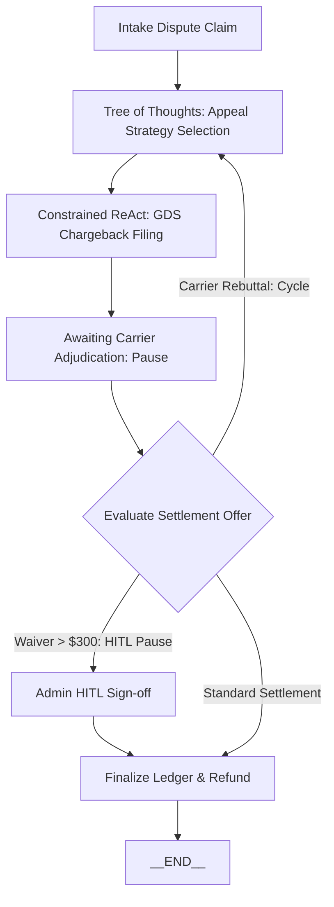
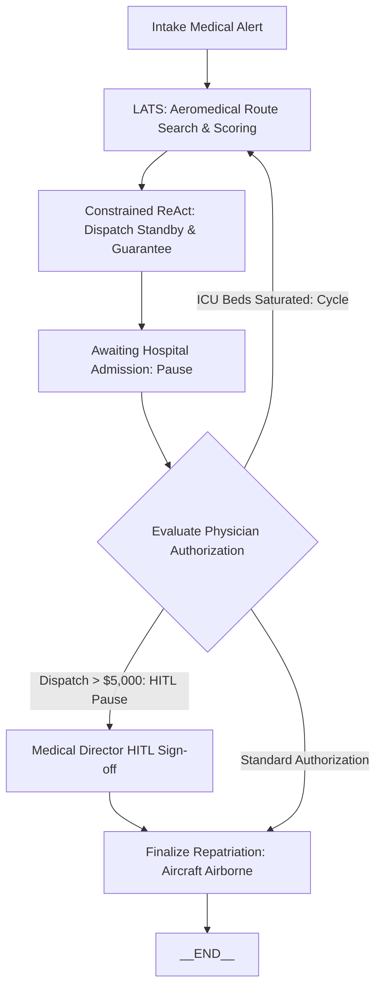

# Stateful Agent Graphs (`state_graph/graphs/`)

## Overview
The `state_graph/graphs/` directory houses the three production stateful agent problem graphs for **Wanderpath Travel B.** Each graph models a real-world, high-stakes operational problem that genuinely requires persistent state across sittings, external asynchronous waiting states, human approval gates, and cyclic recovery branches.

---

## The Three Stateful Problems & LLM-Call Additions

| Stateful Problem Graph | File | Why It Genuinely Requires a State Graph | 2 Embedded LLM-Call Additions | HITL Escalation Condition |
|---|---|---|---|---|
| **1. Complex International Visa & Consular Application** | `visa_graph.py` | Spans weeks across diplomatic checkpoints; pauses on asynchronous embassy webhooks/slots (`awaiting_consular_webhook`); cycles on document rejection/request. | 1. **Task Decomposition**: Builds dynamic multi-stage milestones.<br>2. **RAG Architecture**: Retrieves live embassy rules from ChromaDB vector store. | Expedited consular fee exceeds \$500.00 threshold or applicant criminal record flag. |
| **2. Supplier Dispute & Chargeback Appeal** | `dispute_graph.py` | Operates on strict 7-day airline dispute windows; pauses on carrier arbitration settlements (`awaiting_carrier_adjudication`); cycles to re-evaluate appeal strategies if rejected. | 1. **Tree of Thoughts (ToT)**: Evaluates competing legal appeal strategies (EU261 vs. Force Majeure).<br>2. **Constrained ReAct**: Executes whitelisted GDS filing tools with schema defense. | Carrier requires fee waiver > \$300.00 or demands Wanderpath legal indemnification. |
| **3. VIP Emergency Medical Evacuation & Repatriation** | `medevac_graph.py` | Mission-critical workflow; pauses on receiving hospital ICU bed confirmation (`awaiting_hospital_admission`); cycles if primary hospital saturates. | 1. **LATS**: Explores and scores medevac flight routings against live airfield and medical constraints.<br>2. **Constrained ReAct**: Issues cryptographically signed guarantee letters and private charter standby. | Irreversible air ambulance aircraft dispatch and guarantee amount > \$5,000.00. |

---

## Architectural Rationale for LLM Additions

### Graph 1: Visa Application (`visa_graph.py`)
- **Task Decomposition**: Consular workflows are not single-step submissions. They require breaking down passport validity validation, certified translation procurement, biometric booking, and courier tracking.
- **RAG Architecture**: Embassy policies change constantly (e.g. Schengen visa fee increases, Indonesian VoA validity windows). The node queries `WanderpathVectorStore` directly to ensure real-time policy compliance.

### Graph 2: Supplier Dispute (`dispute_graph.py`)
- **Tree of Thoughts (ToT)**: In contract disputes, multiple plausible arguments exist (e.g. EU261 statutory claim vs. Carrier breach of contract vs. Commercial goodwill). ToT generates all three thought branches and scores each on estimated monetary recovery and legal confidence.
- **Constrained ReAct**: Direct interaction with airline GDS systems requires strict schema compliance without hallucinated parameters.

### Graph 3: VIP Medical Evacuation (`medevac_graph.py`)
- **LATS (Language Agent Tree Search)**: High-stakes aeromedical dispatch cannot rely on simple prompt generation. LATS tree-searches candidate routings scored against external ground truth (airfield runway length, 24/7 nighttime customs clearance, medical equipment load, and ICU capability).
- **Constrained ReAct**: Executes authorized standby dispatch tools and issues structured guarantees of payment (GOP).

---

## State Graph Transition Diagrams

### 1. Visa Application Graph


### 2. Supplier Dispute Graph


### 3. Medical Evacuation Graph


---

## Verification
Run the automated test suite verifying all 3 stateful graphs:
```bash
mcp_server\.venv\Scripts\python.exe state_graph\tests\test_stateful_graphs.py
```
