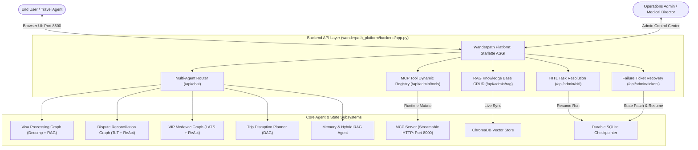

# Wanderpath Full-Stack Platform (`wanderpath_platform/`)

## Overview
The `wanderpath_platform/` package provides the unified, full-stack web application and REST backend connecting all five Wanderpath agents (the 3 state-graph agents, the trip disruption planning agent, and the memory & hybrid RAG agent) to a live Model Context Protocol (MCP) server, SQLite durable checkpointer, ChromaDB vector store, Human-in-the-Loop (HITL) resolution engine, and Failure Ticket recovery center.

---

## System Architecture



---

## File Manifest
* `backend/app.py`: Starlette ASGI backend providing REST endpoints for chat routing, live MCP tool toggles, RAG document management, HITL resolution, and Failure Ticket recovery.
* `frontend/index.html`: Responsive single-page web app built with TailwindCSS and Lucide icons containing:
  - **User Chat Portal**: Sidebar agent switcher across all 5 agents, thread sessions, preset quick-prompts, and live execution status badges.
  - **Admin Operations Center**:
    - *Tab 1 (MCP Tools)*: Real-time toggles enabling/disabling tools on the running server and dynamic tool registration.
    - *Tab 2 (RAG Knowledge)*: Document browser, upload form, and deletion actions syncing with ChromaDB.
    - *Tab 3 (HITL Tasks)*: Pending task queue with contextual state inspection and 1-click Approve / Reject buttons that resume state graphs.
    - *Tab 4 (Failure Tickets)*: Open tickets with stack traces, JSON state patch editor, and "Resolve & Resume Run" action.
    - *Tab 5 (State Checkpoints)*: Live SQLite state checkpoint history.
* `tests/test_platform_e2e.py`: Automated end-to-end integration test validating all API endpoints.

---

## Launching the Platform

### 1. Start the Platform Web Server
```powershell
mcp_server\.venv\Scripts\python.exe -m uvicorn wanderpath_platform.backend.app:app --host 0.0.0.0 --port 8500
```
Open your browser to: **`http://localhost:8500`**

### 2. Run Automated Platform End-to-End Tests
```powershell
mcp_server\.venv\Scripts\python.exe wanderpath_platform\tests\test_platform_e2e.py
```
